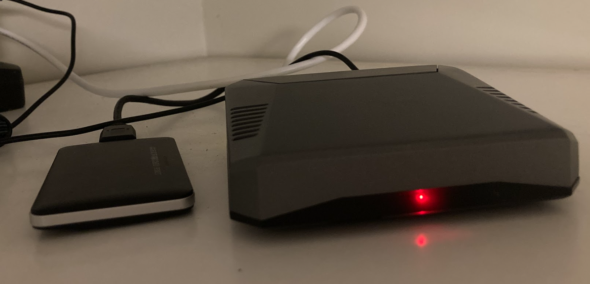

# homelab

This is my homelab which is my sandbox environment for experiments and learning IT.

It's the **Raspberry Pi 4b** in the Argon ONE V2 aluminum case at my home that I use for self hosting open source services. It's not the most powerful server, but it's very capable and it uses very little power.

Some of the services I self host:
- [Traefik](https://traefik.io/traefik/) - reverse proxy for exposing all of services
- [Zerotier](https://www.zerotier.com/) - for remote access to my homelab without a traditional VPN and port forwarding
- [Portainer](https://www.portainer.io/) - for managing docker containers
- [PiHole](https://pi-hole.net/) - a DNS server for network-wide ad blocking
- [Cockpit](https://cockpit-project.org/) - a web-based graphical interface for managing my Raspberry Pi
- [Dozzle](https://dozzle.dev/) - a real-time log viewer for docker containers
- [Glances](https://github.com/nicolargo/glances) - for monitoring my Raspberry Pi
- [Cloudflare Tunnel](https://www.cloudflare.com/products/tunnel/) for exposing services to the internet without port forwarding and [Cloudflare Access](https://www.cloudflare.com/products/zero-trust/access/) for single sign-on (SSO)

Almost everything is deployed with [docker compose](https://docs.docker.com/compose/).
